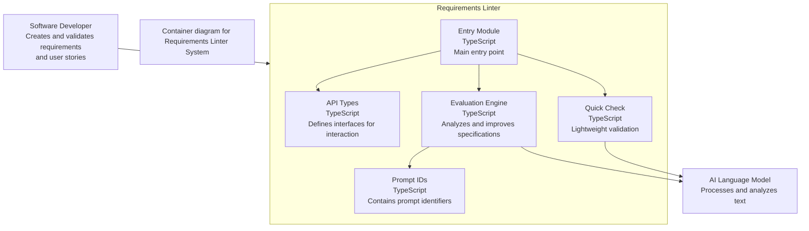

```mermaid
flowchart TB
    title["Container diagram for Requirements Linter System"]
    
    developer["Software Developer\nCreates and validates requirements\nand user stories"]
    
    subgraph requirementsLinter["Requirements Linter"]
        apiTypes["API Types\nTypeScript\nDefines interfaces for interaction"]
        entry["Entry Module\nTypeScript\nMain entry point"]
        evaluateEngine["Evaluation Engine\nTypeScript\nAnalyzes and improves specifications"]
        quickCheck["Quick Check\nTypeScript\nLightweight validation"]
        promptIds["Prompt IDs\nTypeScript\nContains prompt identifiers"]
    end
    
    aiModel["AI Language Model\nProcesses and analyzes text"]
    
    developer --> requirementsLinter
    entry --> apiTypes
    entry --> evaluateEngine
    entry --> quickCheck
    evaluateEngine --> aiModel
    quickCheck --> aiModel
    evaluateEngine --> promptIds
```