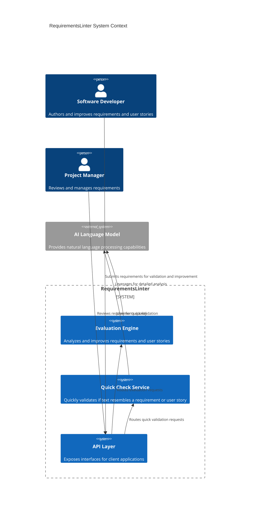

```mermaid
C4Context
title RequirementsLinter System Context

Person(developer, "Software Developer", "Authors and improves requirements and user stories")
Person(projectManager, "Project Manager", "Reviews and manages requirements")

System_Boundary(requirementsLinter, "RequirementsLinter") {
    System(evaluationEngine, "Evaluation Engine", "Analyzes and improves requirements and user stories")
    System(quickCheckService, "Quick Check Service", "Quickly validates if text resembles a requirement or user story")
    System(apiLayer, "API Layer", "Exposes interfaces for client applications")
}

System_Ext(aiModel, "AI Language Model", "Provides natural language processing capabilities")

Rel(developer, apiLayer, "Submits requirements for validation and improvement")
Rel(projectManager, apiLayer, "Reviews requirements quality")
Rel(apiLayer, evaluationEngine, "Routes evaluation requests")
Rel(apiLayer, quickCheckService, "Routes quick validation requests")
Rel(evaluationEngine, aiModel, "Leverages for detailed analysis")
Rel(quickCheckService, aiModel, "Uses for quick validation")
```