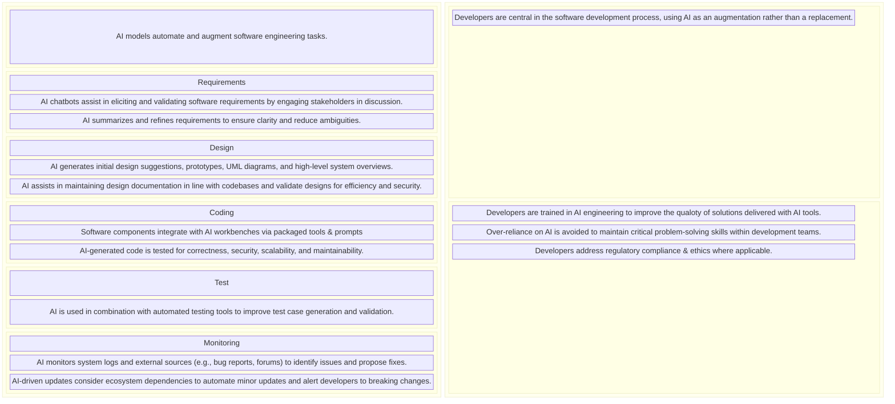

```mermaid
block-beta
  columns 2
  block
    columns 1
       block
       AI0["AI models automate and augment software engineering tasks."] 
       end

       block
          columns 1
          Requirements
          R1["AI chatbots assist in eliciting and validating software requirements by engaging stakeholders in discussion."]
          R2["AI summarizes and refines requirements to ensure clarity and reduce ambiguities."]    
       end   
       block
          columns 1
          Design   
          D1["AI generates initial design suggestions, prototypes, UML diagrams, and high-level system overviews."]
          D2["AI assists in maintaining design documentation in line with codebases and validate designs for efficiency and security."]
       end        
       block
          columns 1
          Coding  
          C12["Software components integrate with AI workbenches via packaged tools & prompts"]               
          C2["AI-generated code is tested for correctness, security, scalability, and maintainability."]                     
       end   
       block
          columns 1
          Test  
          T2["AI is used in combination with automated testing tools to improve test case generation and validation."]
       end         
       block
          columns 1
          Monitoring 
          M1["AI monitors system logs and external sources (e.g., bug reports, forums) to identify issues and propose fixes."]           
          M2["AI-driven updates consider ecosystem dependencies to automate minor updates and alert developers to breaking changes."]
       end  
    
  end
  block
     columns 1
       block
       H0["Developers are central in the software development process, using AI as an augmentation rather than a replacement."] 
       end
       block
          columns 1            
             H2["Developers are trained in AI engineering to improve the qualoty of solutions delivered with AI tools."]     
             H3["Over-reliance on AI is avoided to maintain critical problem-solving skills within development teams."]
             H4["Developers address regulatory compliance & ethics where applicable."]
       end 
  end


```