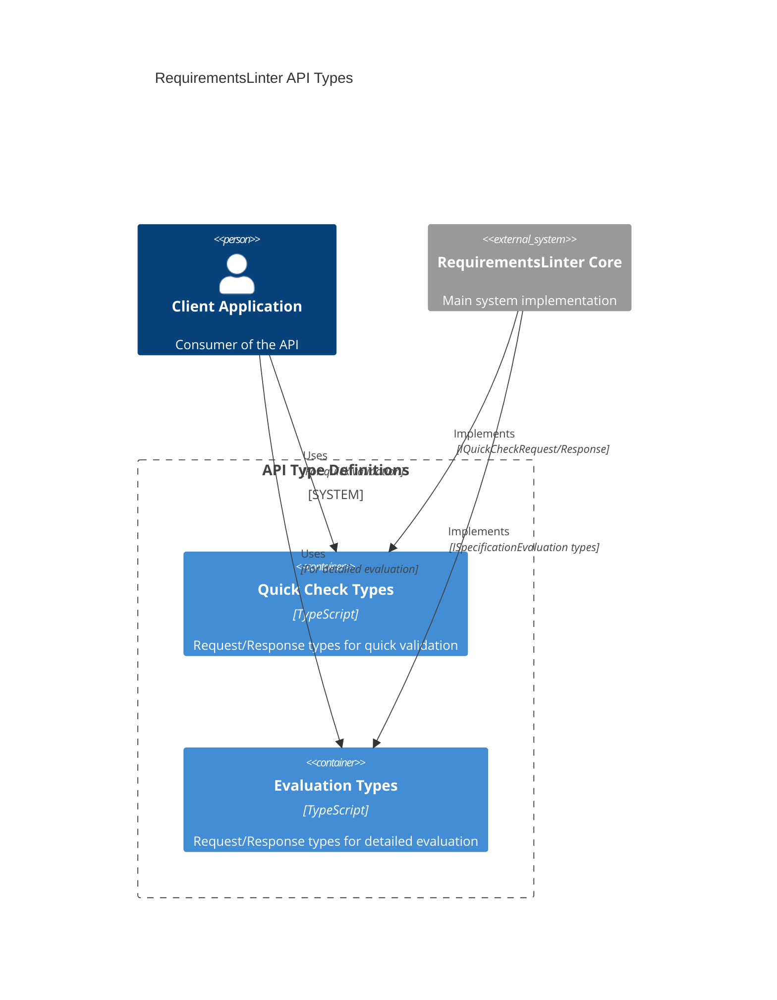

```mermaid
C4Component
    title RequirementsLinter API Types

    Person(client, "Client Application", "Consumer of the API")
    
    System_Boundary(api_types, "API Type Definitions") {
        Container(quick_check_types, "Quick Check Types", "TypeScript", "Request/Response types for quick validation")
        Container(eval_types, "Evaluation Types", "TypeScript", "Request/Response types for detailed evaluation")
    }

    System_Ext(requirements_linter, "RequirementsLinter Core", "Main system implementation")

    Rel(client, quick_check_types, "Uses", "For quick validation")
    Rel(client, eval_types, "Uses", "For detailed evaluation")
    Rel(requirements_linter, quick_check_types, "Implements", "IQuickCheckRequest/Response")
    Rel(requirements_linter, eval_types, "Implements", "ISpecificationEvaluation types")
``` 