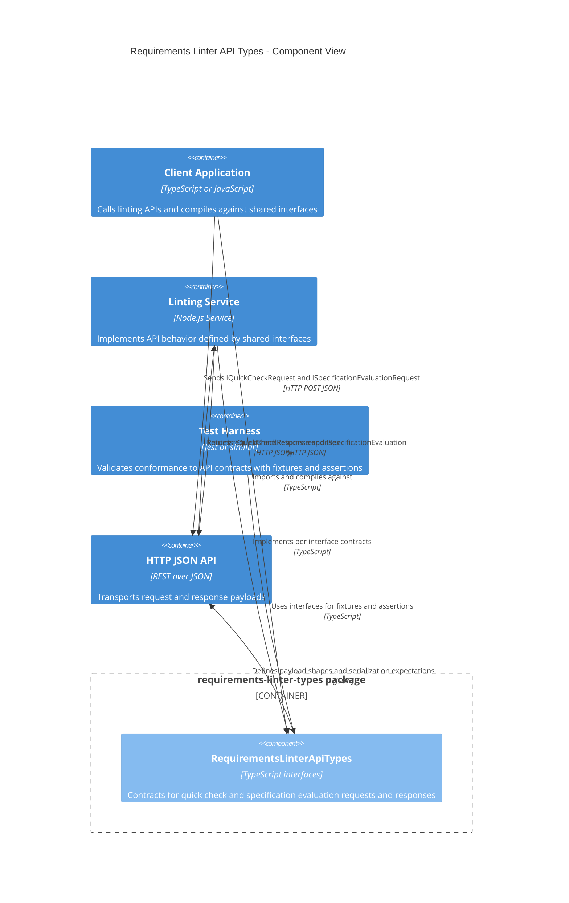

<!-- Generated by StrongAIAutoDoc 20260314 -->

The directory provides a shared contract layer for a requirements linting workflow. It defines TypeScript interfaces used by clients, servers, and tests to exchange consistent request and response payloads. By centralizing API shapes for quick checks and full specification evaluations, it reduces coupling and serialization drift across components. Consumers import the types to implement, validate, and communicate linter behavior over HTTP using predictable JSON structures.

Key components
- RequirementsLinterApiTypes centralizes interface definitions for quick checks and full specification evaluations, enabling strict typing and reliable serialization.
- Client Application imports the types to build valid payloads and handle responses predictably when invoking the linting API.
- Linting Service implements the behavior promised by the interfaces, ensuring compatibility and reducing integration friction.
- Test Harness uses the interfaces to generate fixtures and assertions that catch contract regressions.
- HTTP JSON API is the transport where these contracts become wire formats, keeping client and service aligned end to end.