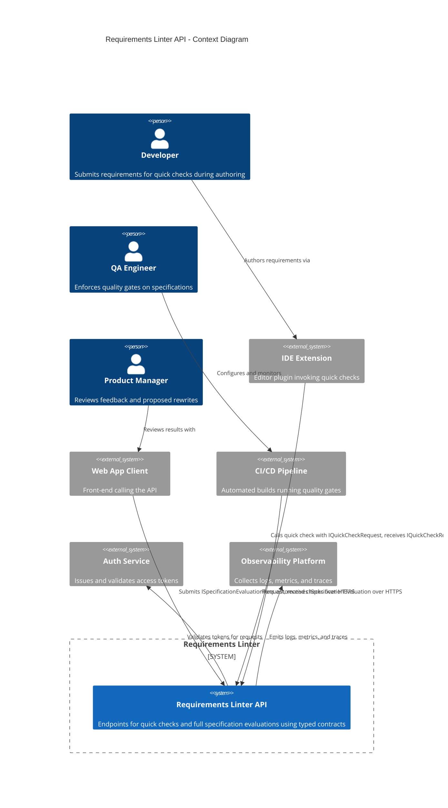

<!-- Generated by StrongAIAutoDoc 20260314 -->

The Requirements Linter API standardizes how clients check individual statements and evaluate full specifications. It serves developers, QA engineers, and product managers through tools such as IDE extensions, a web client, and CI/CD pipelines. Clients submit typed requests for quick checks and full evaluations; the service returns minimal pass/fail signals or richer feedback and proposed rewrites. The API integrates with an authentication service for secure access and an observability platform for diagnostics, ensuring consistent, traceable linting workflows across authoring, review, and automated quality gates.

Key components and interactions:
- Requirements Linter API: Central system offering quick checks and full evaluations using stable TypeScript contracts for interoperability.
- Users: Developers initiate ad-hoc checks in the IDE; QA engineers automate gates in CI/CD; product managers review outputs in a web client.
- External clients: IDE extension and web app call HTTPS endpoints; CI/CD runs batch linting during builds.
- Supporting services: Authentication validates tokens to secure endpoints; observability ingests logs, metrics, and traces for reliability, performance monitoring, and troubleshooting across sessions.