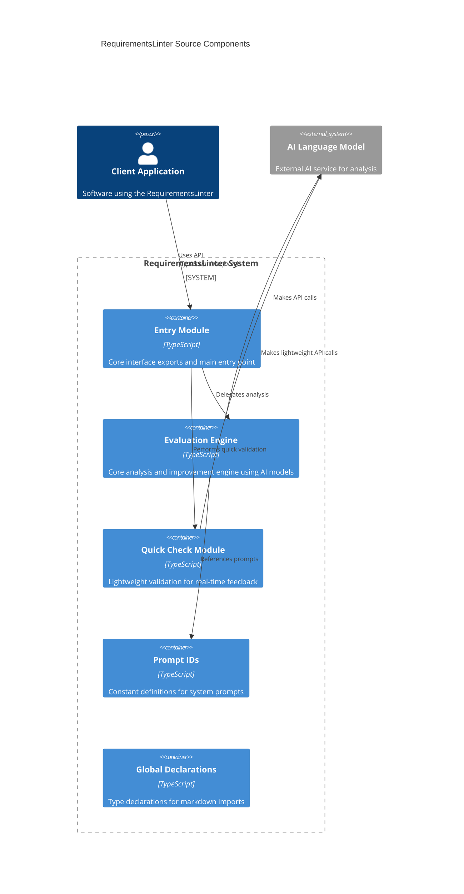

```mermaid
C4Component
    title RequirementsLinter Source Components

    Person(user, "Client Application", "Software using the RequirementsLinter")
    
    System_Boundary(requirements_linter, "RequirementsLinter System") {
        Container(entry, "Entry Module", "TypeScript", "Core interface exports and main entry point")
        Container(evaluate, "Evaluation Engine", "TypeScript", "Core analysis and improvement engine using AI models")
        Container(quick_check, "Quick Check Module", "TypeScript", "Lightweight validation for real-time feedback")
        Container(prompt_ids, "Prompt IDs", "TypeScript", "Constant definitions for system prompts")
        Container(globals, "Global Declarations", "TypeScript", "Type declarations for markdown imports")
    }

    System_Ext(ai_model, "AI Language Model", "External AI service for analysis")

    Rel(user, entry, "Uses API", "TypeScript interfaces")
    Rel(entry, evaluate, "Delegates analysis")
    Rel(entry, quick_check, "Performs quick validation")
    Rel(evaluate, prompt_ids, "References prompts")
    Rel(evaluate, ai_model, "Makes API calls")
    Rel(quick_check, ai_model, "Makes lightweight API calls")
```