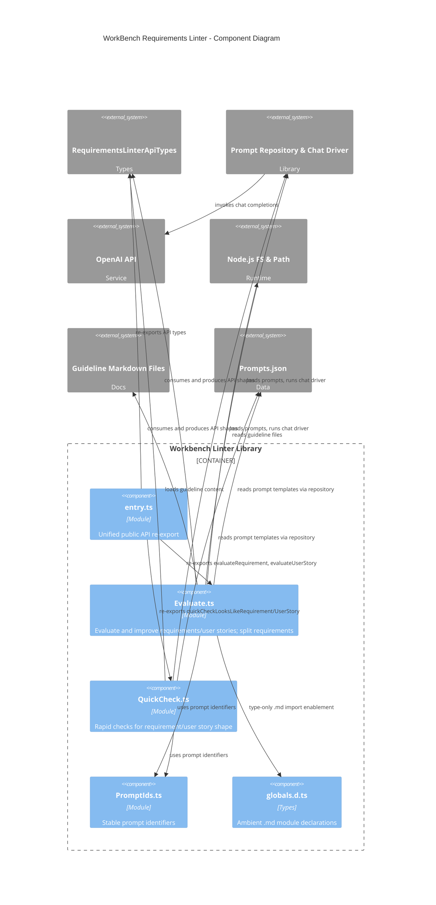

<!-- Generated by StrongAIAutoDoc 20260314 -->

The WorkBench requirements linter directory provides a cohesive API for evaluating and improving requirements and user stories. entry.ts serves as the single integration point, re-exporting API contracts and main analysis functions. Evaluate.ts orchestrates prompt selection, guideline loading, model interaction, improvement, and splitting. QuickCheck.ts offers lightweight yes/no classification via compact prompts. PromptIds.ts centralizes stable prompt identifiers. globals.d.ts enables Markdown imports at compile time. External collaborators include a prompt repository and chat driver, OpenAI’s chat API, Node’s filesystem and path for guideline files, and shared API type definitions.

Key components
- entry.ts: Consolidates public surface area, re-exporting evaluation, quick checks, and canonical API types for simple consumption.
- Evaluate.ts: Core orchestration; selects prompts, injects guidelines and word counts, calls the chat driver, extracts code-fenced results, and splits requirements into atomic statements.
- QuickCheck.ts: Fast heuristic classification using lightweight models; normalizes responses and provides friendly fallbacks.
- PromptIds.ts: Single source of truth for prompt identifiers, ensuring consistency and versioning.
- RequirementsLinterApiTypes: Establishes stable wire contracts for requests and responses.
- Prompt Repository & Chat Driver: Loads Prompts.json and executes prompts against the OpenAI API.
- Node.js FS & Path with Guideline Markdown Files: Supplies guideline content consumed by Evaluate.ts.
- globals.d.ts: Compile-time enabler for .md imports, no runtime impact.