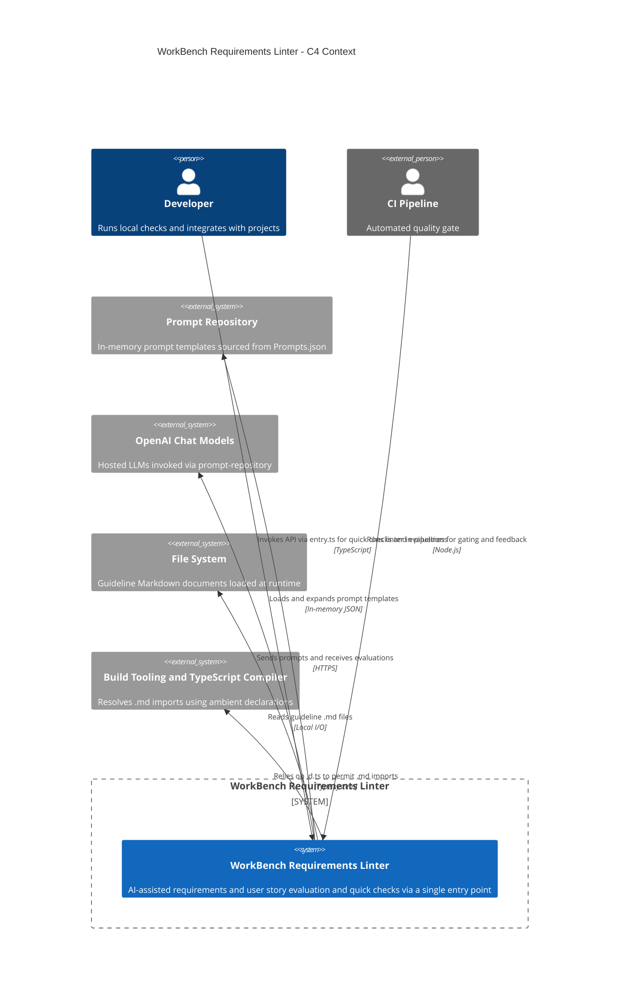

<!-- Generated by StrongAIAutoDoc 20260314 -->

The WorkBench Requirements Linter is a TypeScript library and CI-friendly service that evaluates and improves requirement statements and user stories. It centralizes API types and analysis routines, performing quick pattern checks and deeper guideline-driven assessments using AI prompts. Developers and CI pipelines call its entry point. The linter loads prompt templates and guideline markdown, then delegates to hosted chat models for judgments and improvements, returning structured results suitable for automated feedback, gating, and documentation refinement.

Key components and external interactions:
- Entry module (entry.ts) exposes the public API used by developers and CI jobs. Evaluate.ts orchestrates improvements and full evaluations: it determines target word counts, injects guidelines, expands prompts, calls the chat driver, and extracts fenced outputs; it also splits composite requirements. QuickCheck.ts offers lightweight yes/no checks using a smaller model.
- Externals include the Prompt Repository (in-memory templates from Prompts.json), which supplies prompt definitions; hosted OpenAI chat models, accessed via the prompt-repository ChatDriverFactory; the local file system, which provides guideline Markdown documents; and build tooling or the TypeScript compiler, which resolves .md imports through ambient declarations. Together these dependencies enable consistent prompting, reproducible audits, and scalable automation.