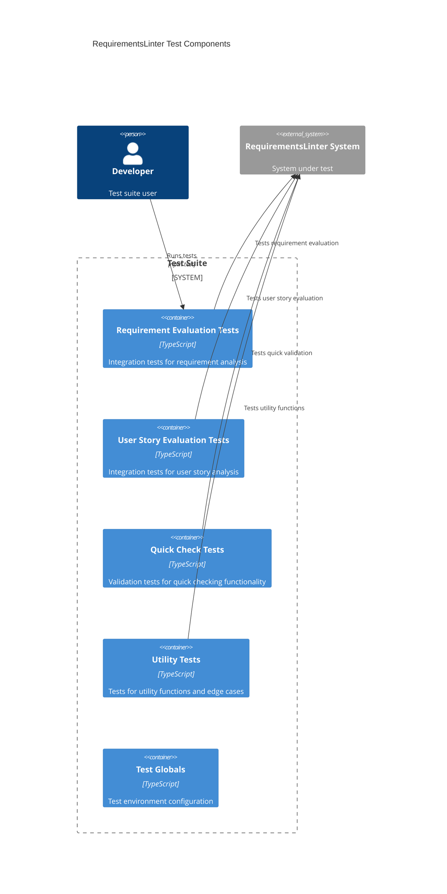

```mermaid
C4Component
    title RequirementsLinter Test Components

    Person(developer, "Developer", "Test suite user")
    
    System_Boundary(test_suite, "Test Suite") {
        Container(req_eval_test, "Requirement Evaluation Tests", "TypeScript", "Integration tests for requirement analysis")
        Container(story_eval_test, "User Story Evaluation Tests", "TypeScript", "Integration tests for user story analysis")
        Container(quick_check_test, "Quick Check Tests", "TypeScript", "Validation tests for quick checking functionality")
        Container(utils_test, "Utility Tests", "TypeScript", "Tests for utility functions and edge cases")
        Container(globals_test, "Test Globals", "TypeScript", "Test environment configuration")
    }

    System_Ext(main_system, "RequirementsLinter System", "System under test")

    Rel(developer, req_eval_test, "Runs tests", "npm test")
    Rel(req_eval_test, main_system, "Tests requirement evaluation")
    Rel(story_eval_test, main_system, "Tests user story evaluation")
    Rel(quick_check_test, main_system, "Tests quick validation")
    Rel(utils_test, main_system, "Tests utility functions")
```