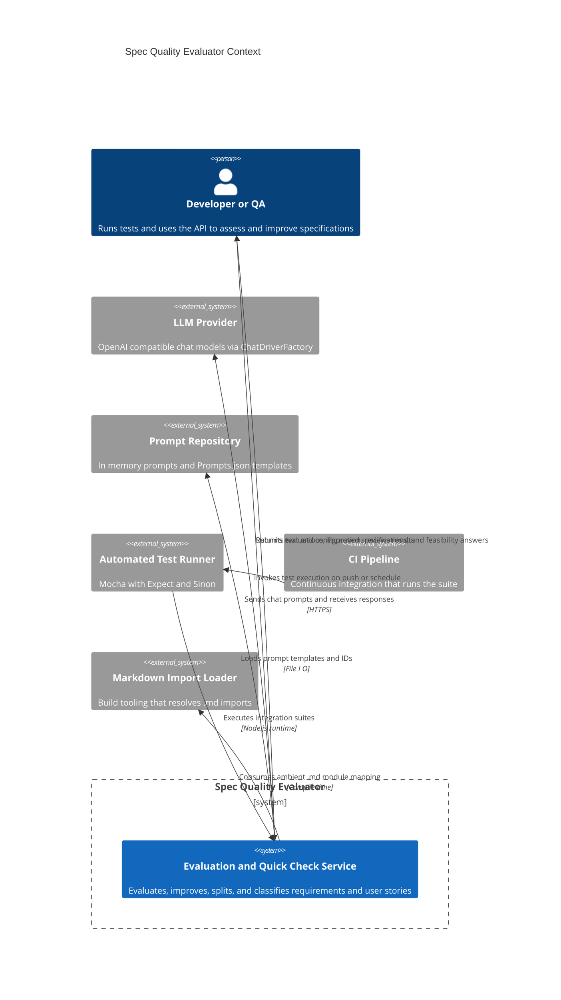

<!-- Generated by StrongAIAutoDoc 20260314 -->

This system evaluates and improves natural language requirements and user stories. It offers quick checks for specification shape, feasibility assessments, and intelligent splitting of compound requirements. The core service interacts with a prompt repository to assemble model requests and with an LLM provider to obtain structured feedback and rewritten text. Developers and QA engineers drive the system via automated tests and direct calls. A test runner validates end to end behavior, while a CI pipeline executes the suites for regression safety. The design supports deterministic testing through stubbing and uses session identifiers to group calls.

Key components and external interactions:
- LLM Provider: The service constructs chat prompts using domain templates and sends them to an OpenAI compatible model via ChatDriverFactory. Responses drive evaluation text, improved specifications, feasibility yes or no, and quick check classification.
- Prompt Repository: An in memory repository backed by Prompts.json supplies stable prompt IDs and templates, enabling reproducible behavior and easier stubbing in tests.
- Automated Test Runner: Mocha with Expect and Sinon runs asynchronous integration suites, asserts on structured outputs, and stubs model calls for adversarial and edge scenarios.
- CI Pipeline: Orchestrates automated execution of the test suites to prevent regressions.
- Markdown Import Loader: Tooling resolves .md imports at build time using ambient type declarations, ensuring smooth compilation without runtime coupling.